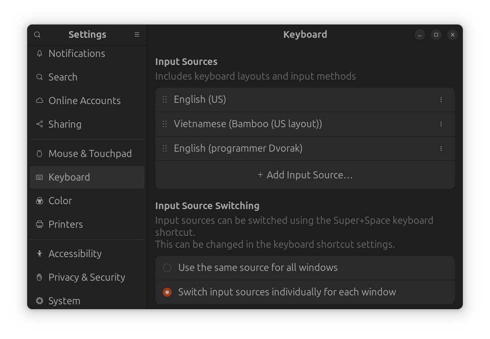
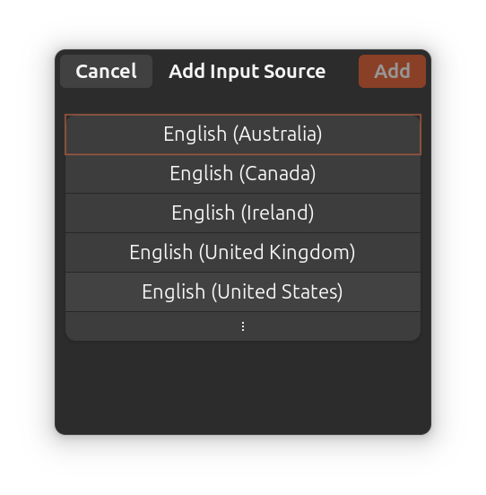
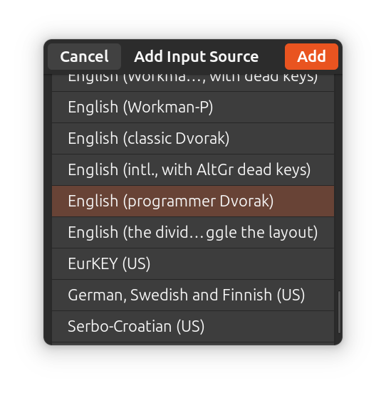

# Learn Dvorak layout, a new CHALLENGE, a new IMPROVEMENT
> I use Dvorak layout to write this README
Here are my learning progress of mastering Programmer's Dvorak layout


## Setting Up
Linux already have Dvorak in base keyboard setting
# 1) Select Add Input Source...

# 2) Choose My Main Language

# 3) Find The Right Oned


## Customize 
In the first place, I used Snap to load VS Code, which resulted in VS Code not recognizing any keyboard layout other than English (US) because it was using XWayland instead of Wayland to run modern applications.
So I deleted it and download the .deb file in official VS Code website.
```bash
sudo snap remove code
wget -O vscode.deb "[https://code.visualstudio.com/sha/download](https://code.visualstudio.com/sha/download)?..."
sudo apt install ./vscode.deb
rm vscode.deb
```

After that I enable Wayland in VS Code config file
```bash
nano /home/user/.config/code-flags.conf 
```
```bash
--ozone-platform-hint=auto
--enable-features=WaylandWindowDecorations
``` 


